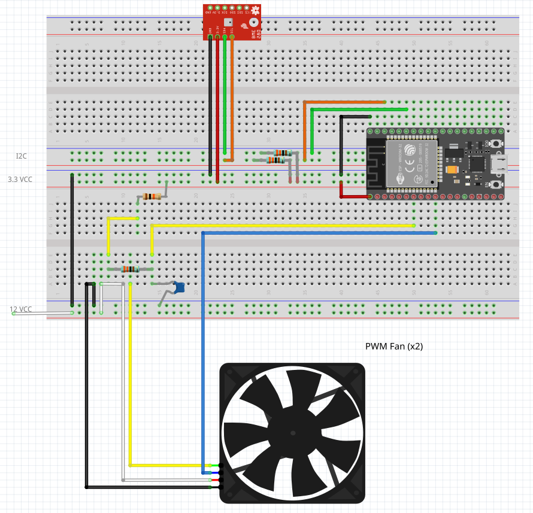

# PWM Fan Controller using ESP32

Drives one ore more PWM fans, adjusting speed according to measured temperature.
Temperature is measured using a BMP280, which also offers air pressure and relative
humidity.

All sensor measurements, as well as RPM measured from one of the fans, are reported
to an MQTT server.
An MQTT topic can be used to override the fan speed.

Works well with Node RED.

**Disclaimer:** This was the first useful thing I ever did with DIY hardware that fully works.
As such, the code isn't as clean as it could be.
Still, it has been keeping my small home lab cool for over two years now.

## Parts

* ESP32 dev kit
* BMP280 sensor
* One or more PWM fans
* Wires, resistors, and capacitors.

## Setup

## Building

Copy `include/config.example.h` to `include/config.h` and set WiFi parameters, as well as the MQTT server.
The rest is the usual PlatformIO workflow.
